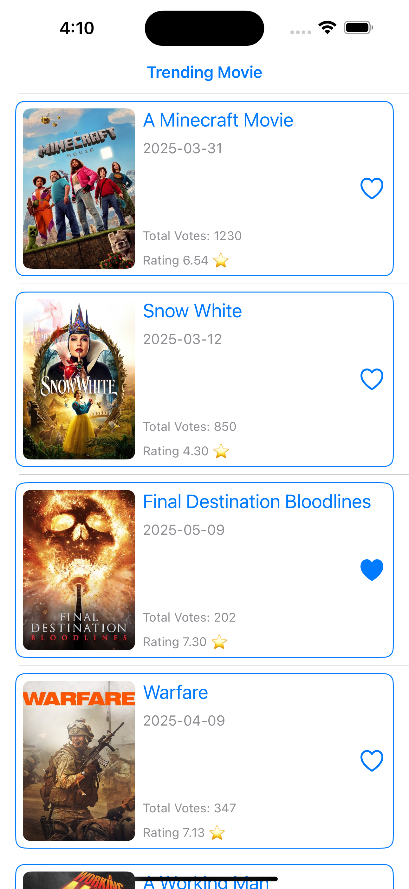
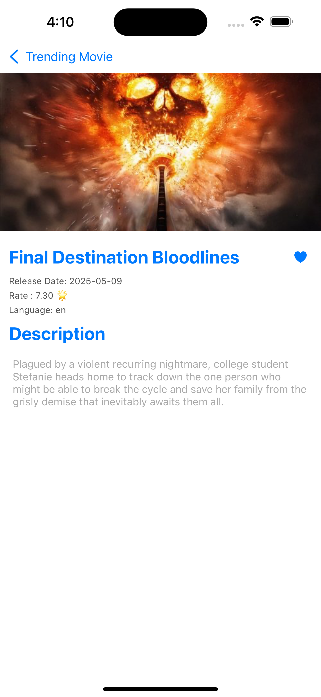

# 🎬 Movie List App

A simple yet clean Movie Listing iOS application built with **Swift**, using **UIKit** and **MVVM with Coordinator pattern**. It integrates with the [TMDB API](https://www.themoviedb.org/documentation/api) to fetch and display movie data and allows users to mark movies as favorites using **Core Data** for local persistence.

---

## 📱 Features

- ✅ Fetch and display a list of popular movies from TMDB.
- 📝 Each movie item in the list shows:
  - Title
  - Release date
  - Rating (average vote)
  - Vote count
  - Favorite button (toggle and persist)
- 📄 Tap on a movie to view a **detail screen** showing:
  - Movie poster
  - Release date
  - Original language
  - Full description (overview)
- ❤️ Favorite movies are stored locally using **Core Data**.
- 🌐 Network calls are handled using **async/await** with **Combine** for reactivity.

---

## 🧱 Architecture

The app is structured using **MVVM (Model-View-ViewModel)** with the **Coordinator pattern** to handle navigation and separation of concerns.

### Main Technologies:

- **UIKit**: Interface and view building.
- **MVVM**:  architecture for separation of UI and business logic.
- **Coordinator Pattern**: For decoupling navigation logic.
- **Core Data**: For persisting favorite movies locally.
- **Combine**: For reactive data binding and state management.
- **Async/Await**: For modern and clean asynchronous code.

---

## 📦 Dependencies

- Combine (built-in)
- TMDB REST API (via URLSession)
- Core Data (native Apple persistence framework)

---

## 📸 Screenshots

| Movie List | Movie Details |
|------------|----------------|
|  |  |

---

## 🛠️ Setup Instructions

1. Clone the repository:
   ```bash
   git clone https://github.com/iOSMahmoudSaad/Paymob-Task.git
   ```

2. Open the `.xcodeproj` or `.xcworkspace` file.

3. Insert your TMDB API key in the appropriate configuration (usually in a `Secrets.plist` or constant file):
   ```swift
   let apiKey = "YOUR_TMDB_API_KEY"
   ```

4. Build and run on simulator or real device.

---

## 🧪 Future Improvements

- Search functionality.
- Add Favourite Screen .
- Refcator architecture to Clean architecture With MVVM

## 👨‍💻 Author

Mahmoud Saad 
iOS Engineer
Feel free to reach out on [LinkedIn](https://www.linkedin.com/in/mahmoud-saad-ios/)
